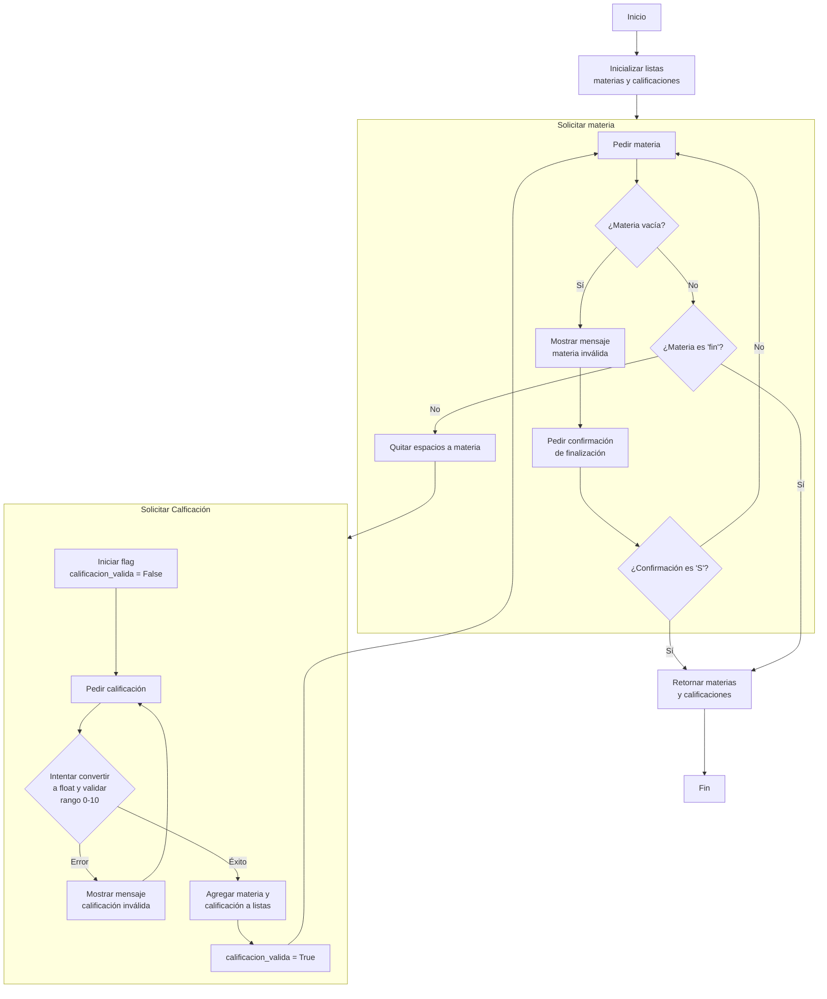

# Diagrama de flujo 

```mermaid
flowchart TD
direction TB
    A[Inicio] --> B[Inicializar listas<br>materias y calificaciones]
    B --> Proceso_Materia

    subgraph Proceso_Materia["Solicitar materia"]
        C[Pedir materia] --> D{¿Materia vacía?}
        D -->|Sí| E[Mostrar mensaje<br>materia inválida]
        E --> F[Pedir confirmación<br>de finalización]
        F --> G{¿Confirmación es 'S'?}
        G -->|No| C
        D -->|No| I{¿Materia es 'fin'?}
        I -->|No| J[Quitar espacios a materia]
    end

    subgraph Proceso_Calificacion["Solicitar Calficación"]
        K[Iniciar flag<br>calificacion_valida = False] --> L
        L[Pedir calificación] --> M
        M{Intentar convertir<br>a float y validar<br>rango 0-10} -->|Error| N
        N[Mostrar mensaje<br>calificación inválida] --> L
        M -->|Éxito| O[Agregar materia y<br>calificación a listas]
        O --> P[calificacion_valida = True]
    end

    G -->|Sí| H[Retornar materias<br>y calificaciones]
    I -->|Sí| H
    J --> Proceso_Calificacion
    P --> C
    H --> Q[Fin]
```